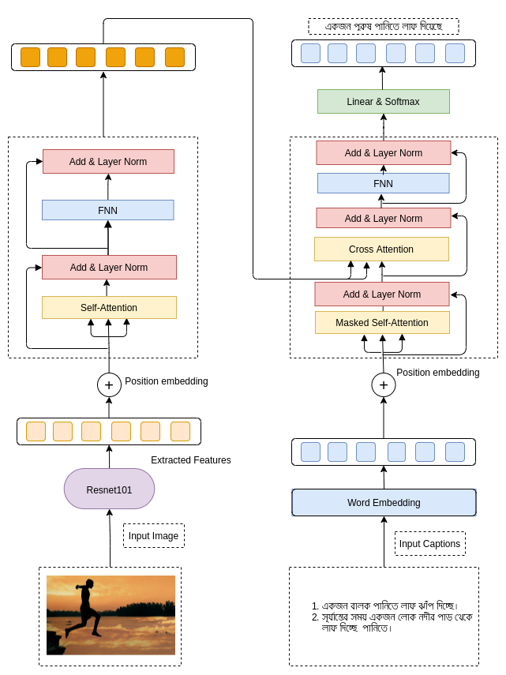
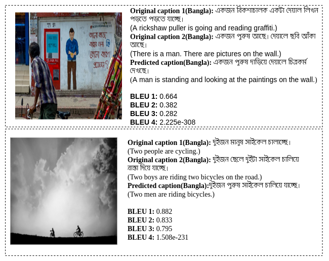

Pytorch implementationof the paper [Bangla Image Caption Generation through CNN-Transformer based Encoder-Decoder Network](https://paperswithcode.com/paper/bangla-image-caption-generation-through-cnn).

### Abstract
Abstract. automatic image captioning is the neverMending effort of creating syntactically and validating the accuracy of textual descriptions of an image in natural language with contextN the encoderMdecoder structure used throughout existing bengali image captioning HbicI research utilized abstract image feature vectors as the encoderGs inputN we propose a novel transformer based architecture with an attention mechanism with a preMtrained resnetMQPQ model image encoder for feature extraction from imagesN experiments demonstrate that the language decoder in our technique captures fine grained information in the caption and then paired with image featuresL produces accurate and diverse captions on the banglalekhaimagecaptions dataset.



### Dependencies
python 3.6+

In addition, please add the project folder to PYTHONPATH and `pip install` the following packages:
- `torch`
- `torchvision`
- `numpy`
- `torchfile`
- `nltk`
- `transformers`
- `tqdm`

## Data preparation

Download [BanglaLekhaImageCaptions](https://data.mendeley.com/datasets/rxxch9vw59/2) dataset.
We expect the directory structure to be the following:
```
path/to/coco/
  annotations/  # annotation json files
  train2017/    # train images
  val2017/      # val images
```
## Training
Tweak the hyperparameters from <a href='https://github.com/aminulpalash/BanglaImageCaptioning/blob/master/configuration.py'>configuration</a> file.

To train baseline model on a single GPU for 50 epochs run:
```
$ python main.py
```


## Testing
To test out model with your own images.
```
$ python predict.py --path /path/to/image --v v2  // You can choose between v1, v2, v3 [default is v3]
```

**Examples captions by our model**


